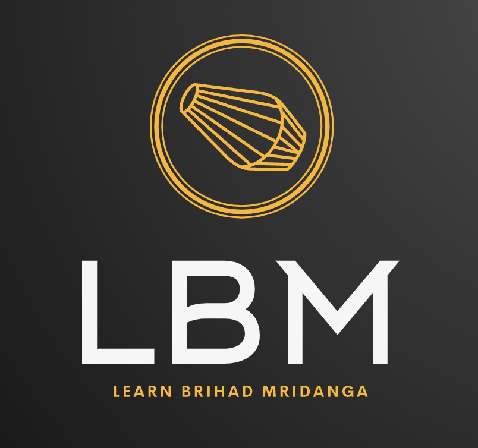

# 🎶 Learn Brihad Mridanga (LBM)

A modern React website for **Learn Brihad Mridanga (LBM)** — an online space to learn and stay updated about Brihad Mridanga classes.

---

## ✨ Features
- **About Page**: Information about the school and classes (coming soon).  
- **Class Schedules & Registration**:
  - Embedded **Google Calendar** (read-only, view upcoming events).  
  - Embedded **Google Form** for easy class registration.  
- **Payments Page**:
  - Display of accepted payment methods (**Zelle** and **Venmo**).  
  - Placeholder QR codes for quick mobile payments.  
- **Dark Theme**: Clean, modern look with simple styling.  
- **Responsive Navigation**: Tabs for About, Classes, and Payments.

---

## 🛠️ Tech Stack
- [React](https://react.dev/) (via [Vite](https://vitejs.dev/))  
- [TypeScript](https://www.typescriptlang.org/)  
- [React Router](https://reactrouter.com/) for navigation  
- Plain CSS for dark theme styling  

---
